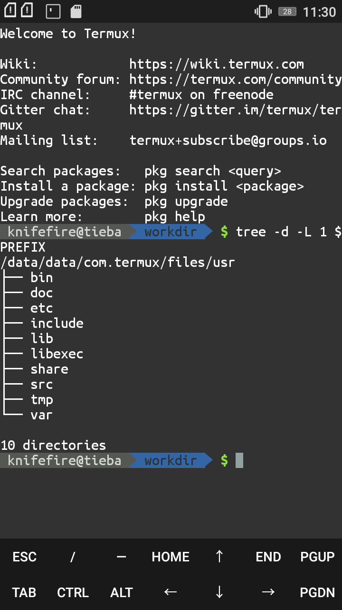

# Magic

先看看效果图。



配置文件如下

**BASH**

```shell
#致谢：
#ezprompt.net

#bash easy agnoster
export PS1="\[\e[30;42m\]\w\[\e[m\]\[\e[32;40m\]▶\[\e[m\] "

#Go Bullet -- Go编写的bash prompt配置工具
export GBT_CARS='Hostname, Dir, Sign'
#设定Prompt块
#Dir指目录
#Hostname指本机信息
#Sign指Prompt前的箭头和用户信息
#还有一些块我不需要，没写

export GBT_CAR_DIR_FG='black'
#Dir块字体色为黑色
export GBT_CAR_DIR_BG='blue'
#Dir块背景色为蓝色
#BG为背景色
#FG为字体色
export GBT_CAR_HOSTNAME_FG='light_gray'
export GBT_CAR_HOSTNAME_BG='dark_gray'
#Hostname块配色
export GBT_CAR_HOSTNAME_FORMAT=' Ghost@github '
#Hostname块输出文本
#自己随便写

[ -x $(which gbt) ]&&export PS1='$(gbt)'
```

使用`pkg`安装gbt这个包，将配置加到自己的bashrc中即可。

**FISH**

```fish
function fish_prompt
#Go Bullet -- Go编写的 prompt配置工具
set -x GBT_CARS 'Hostname, Dir, Sign'
#设定Prompt块
#Dir指目录
#Hostname指本机信息
#Sign指Prompt前的箭头和用户信息
#还有一些块我不需要，没写
set -x GBT_CAR_DIR_FG 'black'
#Dir块字体色为黑色
set -x GBT_CAR_DIR_BG 'blue'
#Dir块背景色为蓝色
#BG为背景色
#FG为字体色
set -x GBT_CAR_HOSTNAME_FG 'light_gray'
set -x GBT_CAR_HOSTNAME_BG 'dark_gray'
#Hostname块配色
set -x GBT_CAR_HOSTNAME_FORMAT ' Ghost@github '
#Hostname块输出文本
gbt
end
```

fish要加到`~/.config/fish/functions/fish_prompt.fish`内。

# Note

先要安装powerline字体，建议使用Termux-style。
